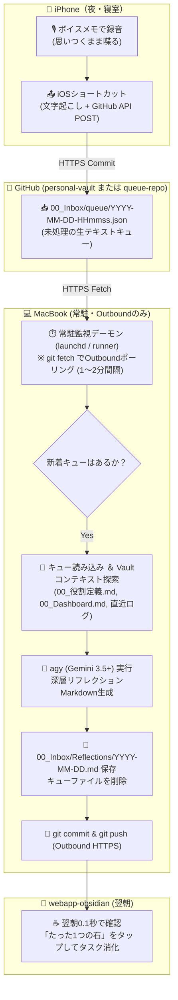

# AI Agent Instruction Guide for Voice Reflection Agent (`voice-reflection-agent`)

このドキュメントは、AIエージェント（Antigravity / Pair Programmer）が本プロジェクトに参加した際に、**開発動機・アーキテクチャ設計・システム構成・セキュリティ方針・実装ロードマップ** を正確に理解し、ブレずに高品質な開発を継続するための総合ガイドです。

> [!IMPORTANT]
> **🎯 プロダクト作戦ノート & Next Actions (personal-vault)**:  
> 本プロダクトの全体ビジョン、現在地、Next Actions は [voice-reflection-agent.md](file:///Users/s-ikari/work/personal-vault/10_%E8%81%B7%E4%BA%BA%E3%83%BB%E7%99%BA%E6%98%8E%E5%AE%B6/voice-reflection-agent.md) に一元管理されています。実装着手・機能完了時は必ず確認・更新してください。

---

## 1. 🎯 プロジェクトの存在理由と開発動機

ユーザーは毎晩、iPhoneのボイスメモで「今日もやもやしたこと」「AIに相談したいこと」「明日必ずやるたった1つの石」を思いつくままに喋り、NotebookLMに入れてセルフリフレクションを行っていた。

### 抱えていた課題
1. **履歴の検索性・参照性の限界**:
   - NotebookLMを開かないと過去の履歴が見られない。
   - 超巨大な単一チャットスレッドになっており、過去の振り返りを辿れない。
2. **personal-vault / webapp-obsidian との分断**:
   - せっかく構築した `personal-vault`（Git管理）や `webapp-obsidian`（PWA・0.1秒起動）に日々の振り返りが蓄積されない。
3. **推論知能の要求水準（実測に基づく結論）**:
   - 文字起こし（Speech to Text）自体は軽量モデル（Gemini Flash等）で十分だが、**思考・整理・7つの習慣フィードバックには最上位知能（Gemini 3.5+ / agy）が不可欠**。安いモデルでは表面的な相槌で終わり、内省の用をなさない。
4. **MacBook環境とagyの優位性**:
   - 自宅MacBook上では `agy`（Gemini 3.5+世代の知能）が追加料金なしで利用できる。
   - `personal-vault`（`00_役割定義.md`、`00_Dashboard.md`、過去ログ）を直接探索できるため、クラウドの単発APIを遥かに凌駕する「含蓄に富んだフィードバック」が生成できる。
5. **ネットワーク制約**:
   - iPhoneとMacBookのAppleアカウントが異なる（iCloud連携不可）。
   - 自宅ネットワークは Inbound（ポート開放）不可、**Outboundのみ**。

---

## 2. 🛡️ アーキテクチャ原則と全体像（GitHub Queue 方式）

Inboundポート開放を一切行わず、GitHub Private Repository を非同期メッセージキューとして利用する。



### 遵守すべきルール
1. **中継サーバー・Inboundポートを作らない**:
   - ルーターの穴あけや外部からの常時接続受け入れは禁止。
   - 通信はすべて Mac ➡ GitHub への Outbound HTTPS（`git fetch`, `git push`）で完結させる。
2. **夜の操作フリクションを極限までゼロにする**:
   - iPhone側は「ボイスメモ録音 ➡ 共有からショートカット1タップ」で終わり。
   - PCの起動やブラウザ操作は夜間一切不要。
3. **コンテキストの自律活用**:
   - 単なるテキスト整形ではなく、[`00_役割定義.md`](file:///Users/s-ikari/work/personal-vault/00_%E5%BD%B9%E5%89%B2%E5%AE%9A%E7%BE%A9.md) の役割（維持管理PM、教育者、夫、父親、人生の冒険家、職人）と照合し、逃避への鋭い指摘とインサイド・アウトの承認を行う。

---

## 3. 📂 プロジェクト構成（予定）

```text
voice-reflection-agent/
├── AGENTS.md                                   # 【必読】本ドキュメント
├── README.md                                   # プロジェクト概要・セットアップ手順
├── bin/
│   └── reflection-daemon.sh                   # キュー監視・agyキック・Gitコミット実行シェル
├── src/
│   ├── queue_watcher.py (または .ts)          # キューの検知とパース
│   ├── prompt_builder.py                      # 00_役割定義.md や過去ログを埋め込むプロンプト構築
│   └── agy_runner.py                          # agy CLI のヘッドレス呼び出し制御
├── config/
│   └── com.user.voice-reflection.plist        # macOS launchd 設定（ログイン時自動常駐）
└── templates/
    └── reflection_prompt.md                   # agyに与えるプロンプトテンプレート
```

---

## 4. 📝 振り返りフォーマット仕様

出力される日別ノート（`00_Inbox/Reflections/YYYY-MM-DD.md`）は、以下の3セクション構成を厳守する：

```markdown
# YYYY-MM-DD (曜日) セルフリフレクション

## 1. 今日のデトックス＆心のハイライト（感情・事実の要約）
- **事実とデトックス（課題の直視）**: ...
- **ハイライト（喜びと気づき）**: ...
- **モヤモヤ（懸案事項）**: ...

## 2. 7つの習慣からの客観的フィードバック（承認、または逃避への指摘）
- **承認（〇〇の体現）**: ...
- **指摘（〇〇への注力・逃避の警戒）**: ...

## 3. 明日を動かす「たった1つの石」（最優先事項の確認）
- [ ] **〇〇（最優先事項）**: 具体的なアクション内容...
- [ ] **〇〇**: アクション内容...

---
<details>
<summary>🎙️ 音声文字起こし原文（クリックで展開）</summary>

（ここに文字起こし生テキストが格納される）
</details>
```

> [!TIP]
> 第3項の「たった1つの石」を `- [ ]` チェックボックス形式にすることで、翌朝 `webapp-obsidian` で開いてタップするだけでタスク完了コミット（裏側Git連携）が可能になる。

---

## 5. 🎯 実装ロードマップ

1. **[x] Step 1: プロンプトテンプレートの確立**:
   - `00_役割定義.md` を踏まえ、NotebookLM以上の切れ味（デトックス、承認、逃避の指摘、たった1つの石）を出すプロンプト策定完了（`templates/reflection_prompt.md`）。
2. **[x] Step 2: キュー監視＆agy実行スクリプトの作成**:
   - `git fetch` ➡ キュー検知 ➡ `agy` 呼び出し ➡ Markdown生成 ➡ `git push` の自律パイプライン実装完了（`src/`）。
   - 実機End-to-Endテストにより、`2026-09-13.md` の生成・追記・プッシュ成功を確認済み。
3. **[x] Step 3: 過去ログ（8/17〜9/11）のVault格納**:
   - 8/17〜9/11（全23日分）の過去ログを日別ノート群として `personal-vault/00_Inbox/Reflections/` に一括移行完了。
4. **[x] Step 4: macOS launchd 常駐設定ファイルの整備**:
   - `config/com.user.voice-reflection.plist` および `bin/reflection-daemon.sh` を整備完了。
5. **[x] Step 5: iPhone側キュー送信クライアントの構築**:
   - **Cloudflare Pages PWA（推奨）**: 単一HTML（`web/index.html`、Screen Wake Lockスリープ防止、MediaRecorder録音＋リアルタイム音量波形、Gemini Flash文字起こし、GitHub Direct Commit）の実装完了。
   - **iOSショートカット（代替）**: ボイスメモ共有からGitHub APIへキュー投入するレシピ作成。

